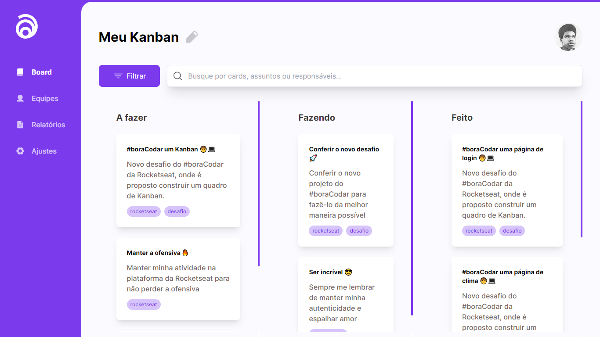

<h1 align="center"> Kanban - Desafio 11 </h1>

Desafios exclusivos, promovido pela Rockeseat.  

  

 

  <h3 align='center'>Web</h3>
  

## 🛑 Status

 - Em desenvolvimento 🛑

## 👨🏼‍💻 Funções

 - Next Fonts
 - Drag and Drop na mesma lista
 - Drag and Drop em uma lista diferente (Atualização futura)
 - Filtro com o input (Atualização futura)
 - Filtro com as tags (Atualização futura)

## 🚀 Tecnologias

Esse projeto foi desenvolvido com as seguintes tecnologias:

- Next 13
- Typescript
- Tailwindcss
- Phosphor React
- React-Beautiful-dnd
- Git e Github

## 💻 Projeto

Este projeto é o desafio 11 dos challengers semanais da Rocketseat #boraCodar

- [Acesse o projeto e veja como está ficando, online](https://kanban-next-13.vercel.app)

## 🔖 Layout

Você pode visualizar o layout do projeto através [DESSE LINK](https://www.figma.com/file/CbUX7QQ0qcElr0wYpkp7to/%23boracodar---Desafio-12-(Community)). É necessário ter conta no [Figma](https://figma.com) para acessá-lo.

## :memo: Licença

Esse projeto está sob a licença MIT.
